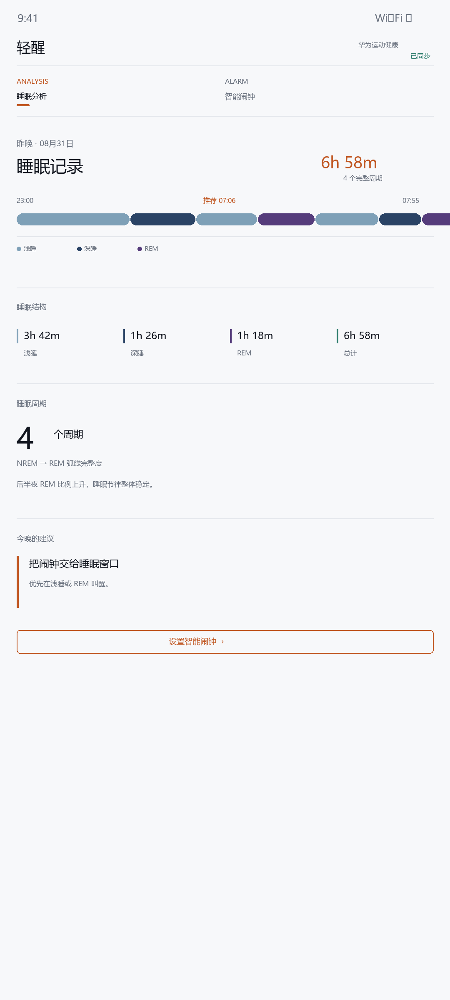
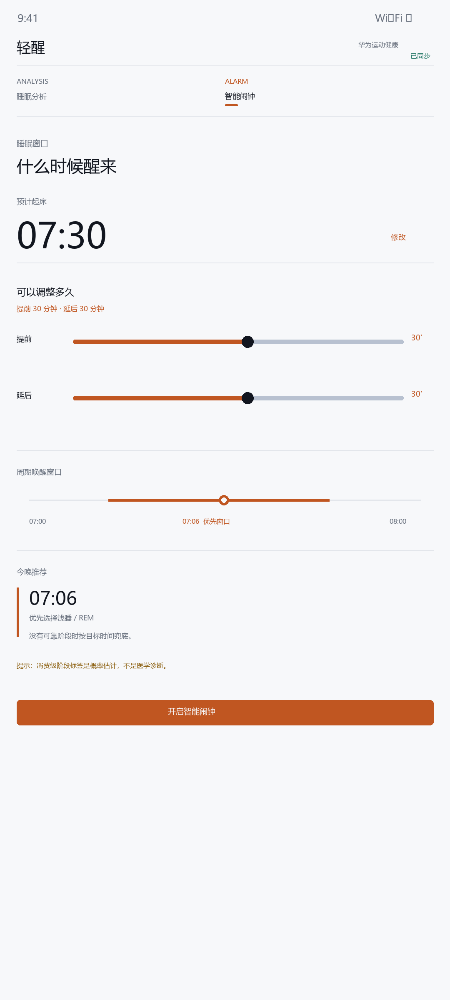

# 轻醒 SleepSmart（Android APK）

这是一个可构建的 Android 应用原型：默认假设华为运动健康已经提供授权后的睡眠阶段数据。当前产品只保留两个核心入口——睡眠分析与智能闹钟；界面层使用 Kotlin + Jetpack Compose Material 3，以连续时间轴、分隔线、数据行和文字导航组织信息，避免卡片堆叠。智能闹钟按预计起床时间和用户允许的提前/延后范围，优先选择浅睡或 REM 时间点，并通过 Android `AlarmManager` 设置本地闹钟。

旧版入口已保留在 `app/src/main/java/com/example/sleepsmart/MainActivity.legacy-20260905.kt.txt`，用于回溯，不参与构建；当前入口为 `app/src/main/java/com/example/sleepsmart/MainActivity.kt`。

## 前端重构（2026-09）

当前前端已改为“晨光编辑版式”：以连续图表、细分割线、数据网格和字体层级组织信息，取消标题下堆叠的圆角卡片和装饰性阴影。睡眠状况页用连续睡眠阶段谱表达深睡、浅睡、REM 与推荐唤醒点；智能闹钟页提供目标起床时间、可接受的提前/延后范围、推荐唤醒点和系统闹钟开关。

## 构建

本机已有 Android SDK 缓存时：

```powershell
./gradlew.bat assembleDebug --no-daemon
```

APK 输出：`app/build/outputs/apk/debug/app-debug.apk`。

当前 UI 使用统一的睡眠主题 token、组件化页面和 TalkBack 语义；本版本固定为明亮配色。真机截图验收需要连接 Android 设备或启动可用模拟器。

首次使用时，应用假设华为运动健康已完成授权与同步，并把睡眠阶段数据交给数据适配层；当前工程用 `VirtualSleepData` 固定演示数据验证产品流程。演示数据会经过 `SleepAnalyzer` 计算睡眠时长、浅睡/深睡/REM 时长和完整的 NREM→REM 睡眠弧线数量，待 HMS Health Service Kit SDK 准入后替换为真实读取。工程不包含 CSV 导入功能。

> 重要：这不是医疗器械，也不能“确保”唤醒时一定处于某个睡眠阶段。消费级设备的阶段标签是概率估计；没有阶段覆盖时，应用按用户目标时间兜底。

## 开源范围

仓库提交 Android 与 Capacitor 前端源码、算法实现、产品文档和构建配置。`.env.local`、Gradle/Node 依赖缓存、构建产物以及本地设计调用输出被 `.gitignore` 排除；这些文件要么包含本机配置，要么可以由构建重新生成。请复制 `.env.example` 作为本地配置模板，不要提交真实密钥。

华为健康真实数据适配器尚未随本仓库宣称完成：它需要 HMS Health Kit 的开发者准入、应用签名和用户授权，并应在真机上单独验收。没有真实阶段数据时，应用明确使用虚拟数据演示，不把演示结果当作医疗判断。

## 界面预览

| 睡眠分析 | 智能闹钟 |
| --- | --- |
|  |  |

## 贡献

欢迎提交 Issue 或 Pull Request。涉及睡眠阶段算法、设备接入和闹钟行为的改动，请同时说明数据来源、测试设备和已知限制。

## License

本项目使用 MIT License，见 [LICENSE](LICENSE)。

详见 [SCIENCE_AND_INTEGRATION.md](SCIENCE_AND_INTEGRATION.md)。
